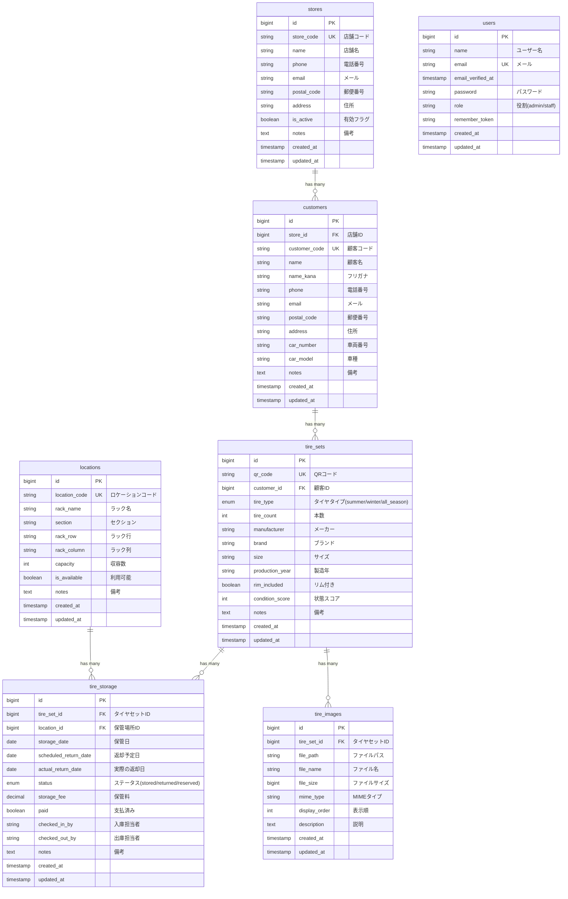

# タイヤ管理システム データベースER図

## ER図（Entity-Relationship Diagram）

## データベース構造の概要

### 主要エンティティ

#### 1. Store（店舗）
- 複数の店舗を管理するためのマスターテーブル
- 各店舗に固有の店舗コード（store_code）を持つ
- 店舗ごとに顧客を管理

#### 2. Customer（顧客）
- 店舗に紐づく顧客情報を管理
- 顧客コード、連絡先、住所、車両情報を保持
- 各顧客は複数のタイヤセットを所有可能

#### 3. TireSet（タイヤセット）
- 顧客が所有するタイヤの情報
- QRコードで一意に識別
- タイヤのタイプ（夏/冬/オールシーズン）、メーカー、サイズ、状態などを記録

#### 4. TireStorage（タイヤ保管履歴）
- タイヤセットの保管・返却履歴を管理
- 保管場所（Location）との紐付け
- 入出庫日、料金、支払状況、担当者を記録
- ステータス管理（保管中/返却済み/予約済み）

#### 5. Location（保管場所）
- タイヤの物理的な保管位置を管理
- ラック名、セクション、行、列で位置を特定
- 収容数と利用可否を管理

#### 6. TireImage（タイヤ画像）
- タイヤセットに関連する画像ファイルを管理
- タイヤの状態確認用の写真を保存
- 表示順序を管理可能

#### 7. User（ユーザー）
- システムの認証・認可を管理
- 役割（admin/staff）によるアクセス制御
- Laravel SanctumトークンによるAPI認証

## リレーションシップ

### 1対多の関係

1. **Store → Customer**
   - 1つの店舗は複数の顧客を持つ
   - 外部キー: `customers.store_id`
   - 削除時: SET NULL

2. **Customer → TireSet**
   - 1人の顧客は複数のタイヤセットを所有
   - 外部キー: `tire_sets.customer_id`
   - 削除時: CASCADE（顧客削除時にタイヤセットも削除）

3. **TireSet → TireStorage**
   - 1つのタイヤセットは複数の保管履歴を持つ
   - 外部キー: `tire_storage.tire_set_id`
   - 削除時: CASCADE

4. **TireSet → TireImage**
   - 1つのタイヤセットは複数の画像を持つ
   - 外部キー: `tire_images.tire_set_id`
   - 削除時: CASCADE

5. **Location → TireStorage**
   - 1つの保管場所は複数の保管履歴を持つ
   - 外部キー: `tire_storage.location_id`
   - 削除時: SET NULL

## インデックス戦略

### ユニークインデックス
- `stores.store_code` - 店舗コード
- `customers.customer_code` - 顧客コード
- `tire_sets.qr_code` - QRコード
- `locations.location_code` - ロケーションコード
- `users.email` - メールアドレス

### 検索用インデックス
- `customers.phone` - 電話番号検索
- `customers.name` - 顧客名検索
- `tire_sets.tire_type` - タイヤタイプフィルタ
- `tire_storage.status` - ステータス検索
- `tire_storage.storage_date` - 保管日検索
- `locations.rack_name` - ラック名検索

## データ整合性

### 外部キー制約
- すべての関連テーブルに外部キー制約を設定
- CASCADE削除: 親データ削除時に関連データも自動削除
- SET NULL: 親データ削除時に外部キーをNULLに設定

### タイムスタンプ
- すべてのテーブルに `created_at` と `updated_at` を設定
- データの作成・更新履歴を自動記録

## 技術仕様

- **ORM**: Laravel Eloquent
- **データベース**: MySQL / SQLite（開発環境）
- **文字コード**: UTF8MB4（多言語対応）
- **認証**: Laravel Sanctum（APIトークン認証）
- **バージョン管理**: Laravel Migrations

## 使用方法

このER図はMermaid記法で記述されています。以下のツールで表示可能です：

1. **GitHub** - このファイルをGitHubにプッシュすると自動的にレンダリングされます
2. **VS Code** - Mermaid Preview拡張機能をインストール
3. **オンラインエディタ** - https://mermaid.live/ で直接編集・表示
4. **ドキュメントツール** - GitBook、Docusaurus、MkDocsなどで使用可能
