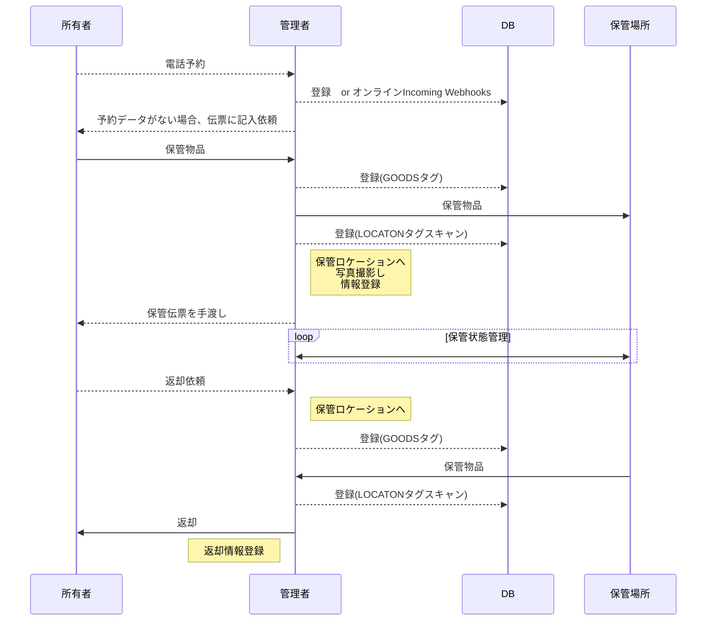
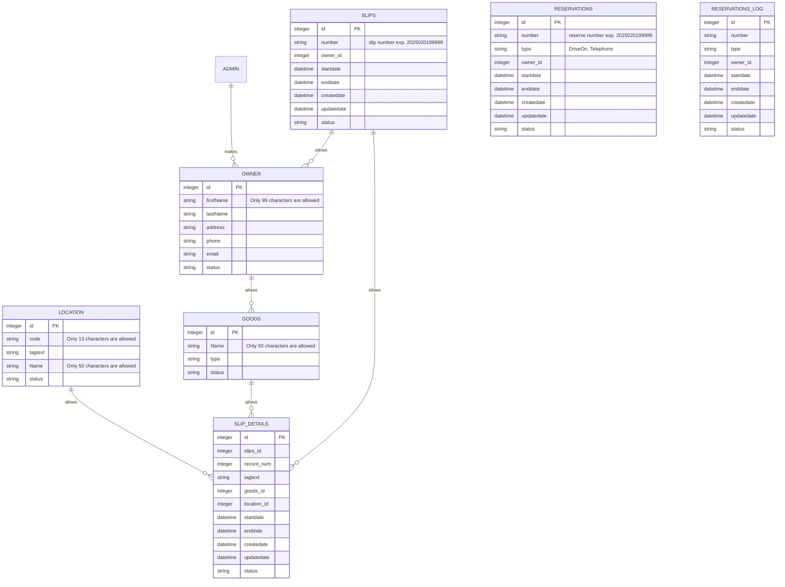

# SSGS
Service station goods strage system
お預かり品管理システムの設計（案）

誰の何を、何処に収納しているのかを管理する。

夏用タイヤ冬用タイヤの交換など一人の利用者が物品を交互に預けられるように
物品ごとにタグ付けする。

# データ構成

1.所有者　OWNER
* 所有者ID
* 所有者属性（名前、他）
* 登録日時
* 変更日時
* ステータス
  
2.品物　GOODS
* 品物ID
* 品物属性（品名、物品区分、他）
* 物品下げタグ（QRコードやRFIDタグなど）
* 所有者ID
* 登録日時
* 変更日時
* ステータス
  
3.場所　LOCATION
* ロケーションID
* ロケーション番号
* ロケーションタグ（QRコードやRFIDタグなど）
* 場所属性（場所名、他）
* 備考
* 登録日時
* 変更日時
* ステータス
  
4.予約伝票 RESERVATIONS
* 伝票ID
* 伝票番号
* 区分
* 所有者ID
* 予約日時
* 備考
* 登録日時
* 変更日時
* ステータス
  
5.保管伝票 SLIPS
* 伝票ID
* 伝票番号
* 所有者ID
* 備考
* 登録日時
* 変更日時
* ステータス

6.伝票明細 SLIP_DETAILS
* 伝票明細ID
* 保管伝票ID
* 明細行NO
* 品物ID
* 場所ID
* 保管開始日時
* 保管終了日時
* 備考
* 登録日時
* 変更日時
* ステータス

# ER図

