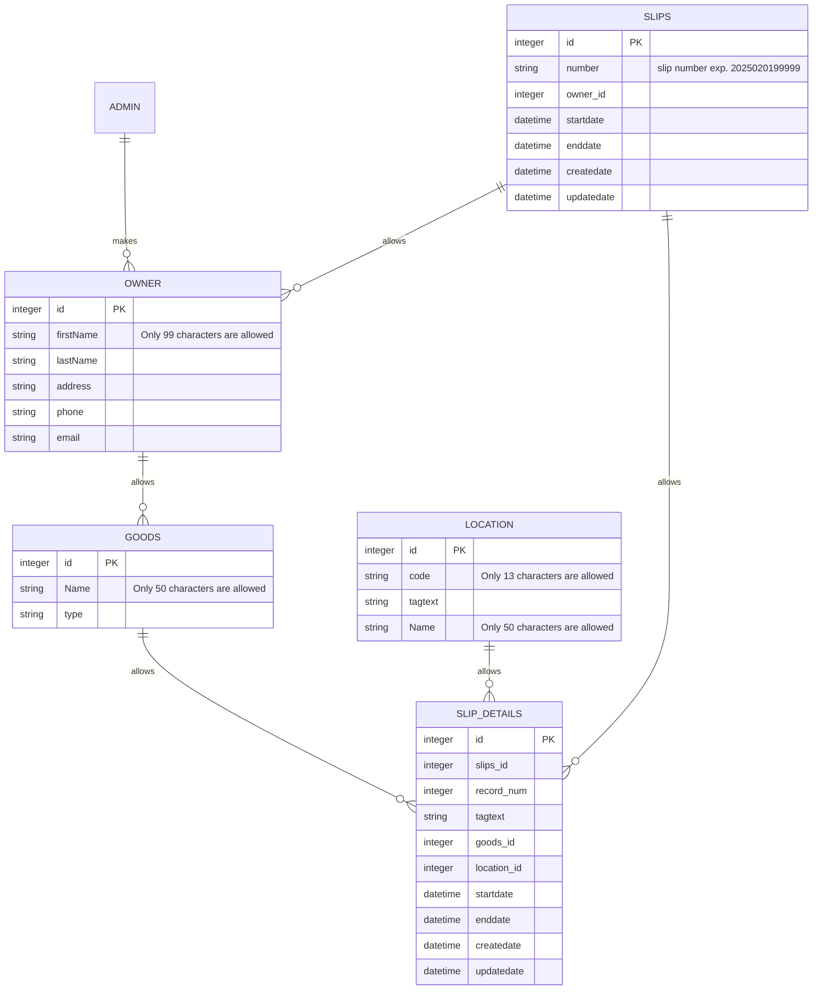

# goods storage
goods strage service

お預かり品管理システムの設計

誰の何を何処に収納しているのかを管理する。

1.所有者　OWNER
* 所有者ID
* 所有者属性（名前、他）

2.品物　GOODS
* 品物ID
* 品物属性（品名、物品区分、他）
* 所有者ID

3.場所　LOCATION
* ロケーションID
* ロケーション番号
* ロケーションタグ（QRコードやRFIDタグなど）
* 場所属性（場所名、他）

4.保管伝票 SLIPS
* 伝票ID
* 伝票番号
* 所有者ID
* 登録日時
* 変更日時

5.伝票明細 SLIP_DETAILS
* 伝票明細ID
* 保管伝票ID
* 明細行NO
* 下げタグ（QRコードやRFIDタグなど）
* 品物ID
* 場所ID
* 保管開始日時
* 保管終了日時
* 登録日時
* 変更日時

